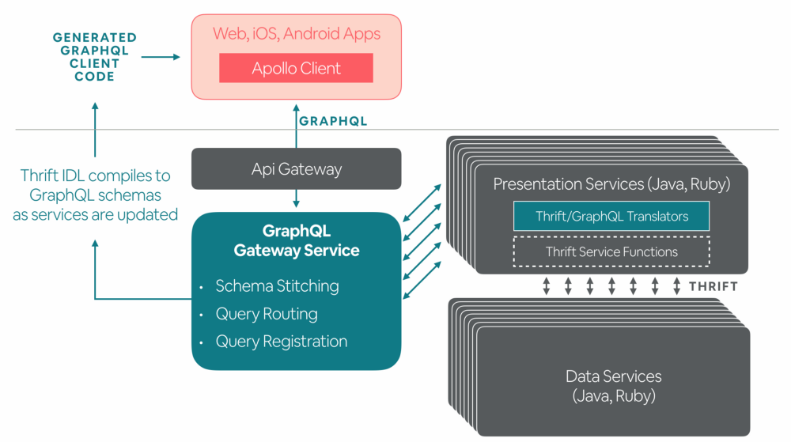
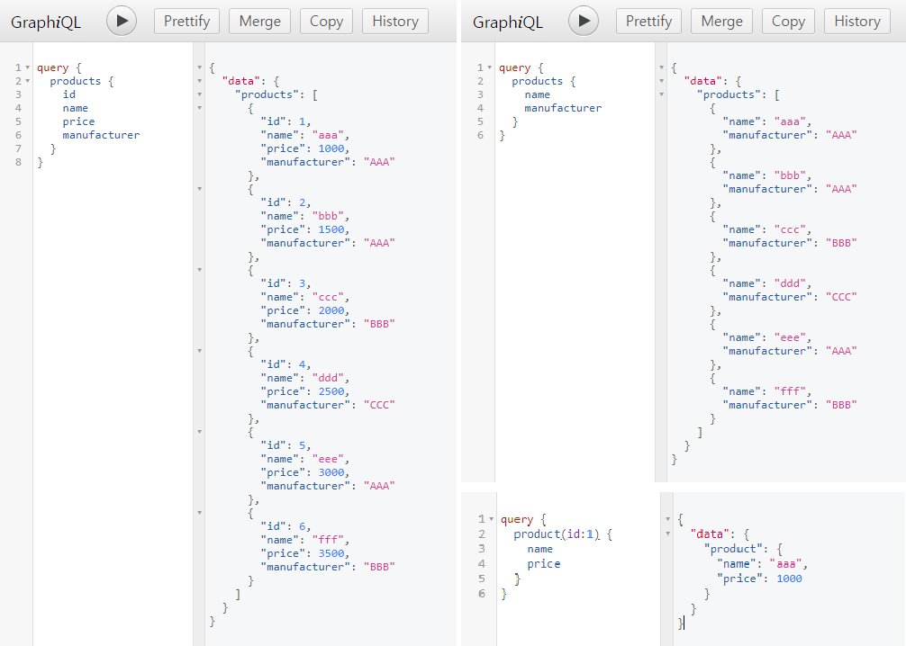
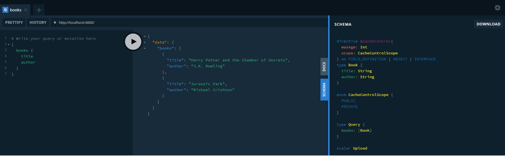

# The NodeJS Study Project

### ■ Installation

- [](https://github.com/mincloud1501/NodeJS/tree/master/node_modules/express) : [Node.js](https://nodejs.org/en/) module available through the [npm registry](https://www.npmjs.com/)
- [](https://github.com/mincloud1501/NodeJS/tree/master/node_modules/morgan) : HTTP request logger middleware for node.js
- [](https://github.com/mincloud1501/NodeJS/tree/master/node_modules/mocha) : Mocha is a feature-rich JavaScript test framework running on Node.js and in the browser
- [](https://github.com/mincloud1501/NodeJS/tree/master/node_modules/should) : should is an expressive, readable, framework-agnostic assertion library
- [](https://github.com/mincloud1501/NodeJS/tree/master/node_modules/supertest) : SuperAgent driven library for testing HTTP servers, TDD(Test-Driven Developement) 지향

```bash
$ npm install express
$ npm install morgan
$ npm i mocha --save-dev # devDependencies 설정
$ npm i should --save-dev
$ npm i supertest --save-dev
```

#### ★ TTD (Test Driven Development)
- test를 먼저 만들고 test를 통과하기 위한 것을 coding하는 것 즉, 만드는 과정에서 우선 test를 작성하고 그걸 통과하는 code를 만들고를 반복하면서 제대로 동작하는지에 대한 feedback을 적극적으로 받는 것
- decision과 feedback 사이의 gap에 대한 인식, gap을 조절하기 위한 기술
- TDD는 프로그래밍 기법이나 기술적인 느낌보다는 심리적인 것으로 볼 수 있다.

### ■ Initialize

```bash
$ npm init

package name: (nodejs) nodejs-api-server
version: (1.0.0)
description:
entry point: (index.js)
test command:
git repository: (https://github.com/mincloud1501/NodeJS.git)
keywords:
author: mincloud
license: (ISC)
Is this ok? (yes) y
```

- mocha framework 사용을 test를 위한 script (index.spec.js) 작성

```js
const assert = require('assert')
const should = require('should')
const request = require('supertest')
const app = require('./index.js')

describe ('GET /users', () => {
    it('return array...', (done) => {
        // assert.equal(1,1) 
        // (1).should.equal(1)
        request(app)
            .get('/users')
            .end((err, res) => {
                res.body.should.be.instanceof(Array)
                res.body.forEach(user => {
                    user.should.have.property('name')
                })
                done()
            })
    })
})
```

- npm package.json 생성 확인 및 start/test script 추가

```bash
{
  "name": "nodejs-api-server",
  "version": "1.0.0",
  "description": "nodejs-api-server",
  "main": "index.js",
  "dependencies": {
    "express": "^4.17.1",
    "morgan": "^1.9.1"
  },
  "devDependencies": {
    "mocha": "^6.2.2"
  },
  "scripts": {
    "start": "node ./index.js",
    "test": "mocha ./index.spec.js"
  },
  "repository": {
    "type": "git",
    "url": "git+https://github.com/mincloud1501/NodeJS.git"
  },
  "author": "mincloud",
  "license": "ISC",
  "bugs": {
    "url": "https://github.com/mincloud1501/NodeJS/issues"
  },
  "homepage": "https://github.com/mincloud1501/NodeJS#readme"
}
```

```bash
$ npm start

> nodejs-api-server@1.0.0 start D:\NodeJS
> node ./index.js

Server running at http://127.0.0.1:3000/
```

- test 환경 구축

```bash
$ npm t # test should

> nodejs-api-server@1.0.0 test D:\NodeJS
> mocha ./index.spec.js

  GET /users
    √ return array...

  1 passing (9ms)

$ npm t # test supertest

> nodejs-api-server@1.0.0 test D:\NodeJS
> mocha ./index.spec.js

  GET /users
  GET /users 200 3.203 ms - 31
    √ return array... (181ms)

  1 passing (198ms)
```

### ■ API Server 개발 (with TDD)

#### ☞ GET /users

```js
app.get('/users', (req, res) => {
    req.query.limit = req.query.limit || 10
    const limit = parseInt(req.query.limit, 10)

    if(Number.isNaN(limit)) {
        res.status(400).end()
        
    } else {
        res.json(users.slice(0, limit))
    }    
})
```

#### ☞ GET /users/:id

```js
app.get('/users/:id', (req, res) => {
    const id = parseInt(req.params.id, 10)
    const user = users.filter(user => user.id === id)[0]

    if(Number.isNaN(id)) {
        return res.status(400).end()
    }

    if(!user) {
        return res.status(404).end()
    }
    
    res.json(user)
})
```

#### ☞ DELETE /users/:id

```js
app.delete('/users/:id', (req, res) => {
    const id = parseInt(req.params.id, 10)
    const user = users.filter(user => user.id === id)[0]
    users = users.filter(user => user.id !== id)

    if(Number.isNaN(id)) {
        return res.status(400).end()
    }
    if(!user) {
        return res.status(404).end()
    }
    res.status(204).end()
})
```

#### ☞ POST /users

- express는 body기능 미지원, body-parser 미들웨어 추가 필요

```bash
$ npm i body-parser --save
```

```js
const bodyParser = require('body-parser')
…
app.use(bodyParser.json())
app.use(bodyParser.urlencoded({extended: true}))
…
app.post('/users', (req, res) => {
    const name = req.body.name

    if(!name) {
        return res.status(400).end()
    }
    const found = users.filter(user => user.name === name).length
    if(found) {
        return res.status(409).end()
    }
    const id = Date.now()
    const user = {id, name}
    users.push(user)
    res.status(201).json(user)
})
```

#### ☞ Refactoring

- user object 분리, express.Router 추가

- What is Refactoring?
	- 외부 동작을 바꾸지 않으면서 내부 구조를 개선하는 방법
	- 코드가 작성된 후에 디자인을 개선하는 작업
	- 모든 것을 미리 생각하기보다는 개발을 하면서 지속적으로 좋은 디자인을 찾는다.
	- 메소드 내의 지역변수와 parameter를 주의 깊게 볼 필요가 있다.
	- 값이 수정되지 않는 변수는 파라미터로 넘길 수 있다.
	- 값이 수정되는 변수는 주의가 필요하다. 변화되는 부분을 함수로 추출하여 리턴 값으로 돌려줄 수 있다.

- ./api/user/index.js

```js
const express = require('express')
const router = express.Router()
const controller = require('./user.controller')
…
router.get('/', controller.getAllList) // Controller Biding
router.get('/:id', controller.getList)
router.delete('/:id', controller.delUser)
router.post('/', controller.addUser)

module.exports = router
```

- ./api/user/index.js

```js
…
module.exports = {
    getAllList,
    getList,
    delUser,
    addUser
}
```

#### ☞ DB Connect (with mysql2)

- DB를 객체로 추상화해 놓은 ORM (Object Relational Mapping)의 method로 data를 관리한다.
- NodeJS SQL ORM으로 sequelize 사용한다.

```bash
$ npm i sequelize --save
$ npm i mysql2 --save
```

- Create config.json

```json
{ 
  "development": {
	"username": "root",
	"password": "root",
	"database": "mincloud",
	"host": "127.0.0.1",
	"dialect": "mysql",
	"operatorAliases" : false
  }
}
```

- DB Table modeling

```js

```

#### ☞ Test Result

```bash
$ npm t

> nodejs-api-server@1.0.0 test D:\NodeJS
> mocha ./api/**/*.spec.js

  GET /users
    Success...
GET /users/1 200 3.199 ms - 21
GET /users 200 0.491 ms - 67
      √ return array...
GET /users?limit=2 200 0.319 ms - 45
      √ Number of maximum limits as well as response...
    Failure...
GET /users?limit=one 400 0.116 ms - -
      √ If limit is not Integer, return 400 code

  GET /users/:id
    Failure...
GET /users/one 400 0.132 ms - -
      √ id is not number
GET /users/9 404 0.098 ms - -
      √ not found id

  DELETE /users/:id
    Success...
DELETE /users/3 204 0.263 ms - -
      √ response 204
    Failure...
DELETE /users/one 400 0.120 ms - -
      √ id is not number
DELETE /users/9 404 0.115 ms - -
      √ not found id

  POST /users
    Success...Create Object
POST /users 201 0.400 ms - 33
      √ response 202 (50ms)
    Failure...
POST /users 400 0.090 ms - -
      √ name is not
POST /users 409 0.141 ms - -
      √ name is duplicated

  11 passing (299ms)
```

---
### REST (REpresentational State Transfer)

- 모든 Resource (자료, User, …) 들을 하나의 Endpoint 에 연결해놓고, 각 Endpoint는 그 Resource 와 관련된 내용만 관리하게 하자는 방법론
- 이런 REST 의 조건을 만족하는 API를 RESTful API라고 하며, 이런 방식으로 API를 작성하는 것을 RESTful하다고 한다.
- RESTful API로는 다양한 기종에서 필요한 정보들을 일일히 구현하는 것이 힘듦 (ex) iOS와 Android에서 필요한 정보들이 조금씩 달랐고, 그 다른 부분마다 API 를 구현하는 것이 힘듦)
- 이 때문에 정보를 사용하는 측에서 원하는 대로 정보를 가져올 수 있고, 보다 편하게 정보를 수정할 수 있도록 하는 표준화된 Query language를 만들게 되었다.

### GraphQL (Graph Query Language) [](https://academy.nomadcoders.co/p/make-a-movie-api-with-graphql-and-nodejs-super-begginner)

- GraphQL은 단일 엔드포인트를 권장한다.
- 모든 요청을 endpoint(/graphql) 한 곳에서 처리하는 것이다.
- REST가 URL과 Resource를 매칭시키는 개념적 모델을 사용했기 때문에 수많은 엔드포인트를 사용했다면, GraphQL의 개념적 모델은 모든 리소스가 그래프처럼 서로 연결되어있기 때문에 URL을 분리할 필요가 없다.
- 서버는 리소스를 가져오는 명령어(Query), 혹은 어떤 리소스를 변경하기 위한 명령어(Mutation)만 제공하면 된다.
- GraphQL의 핵심은, 리소스를 url이 아니라 Query를 통해 표현하는 것이다.
- 기존에 사용하던 REST와 GraphQL을 같이 사용이 가능하다. 기존 REST API는 그대로 놔두고, /graphql 엔드포인트만 새로 만들면 된다.
- GraphQL의 장점은 클라이언트의 요청에 따라 데이터를 더 가져오거나 가져오지 않거나가 결정된다는 점이다.
- 성능에 대한 고려가 깊어질 정도의 요청은 GraphQL로 따지자면 요청하는 데이터의 Depth가 깊다는 것이 될 것이다. 이러한 요청을 피하기 위해서 대개 쿼리의 maxDepth를 설정하여 요청을 제한하는 방식을 주로 구현하여 적용한다.
- Schema를 정의하는 두 가지 방법 : graphql-js, graphql-tools
- DataLoader는 GraphQL을 사용하다 보면 일어나기 쉬운 1+N 문제를 1+1으로 변환시켜주는 자바스크립트 라이브러리다.
- 캐싱은 하나의 클라이언트 요청이 처리되는 동안 일어나는 여러번의 DB 요청 사이의 중복을 줄이는 방식의 캐싱이 사용된다. 즉, 깊이가 깊은 리소스의 Graph를 요청한 경우, 동일한 노드를 여러번 참조하게 될 수도 있다.
  - 예를 들어, 포스트 — 코멘트 — 유저 — 포스트 — 코멘트 — 유저 와 같은 recursive한 6depth짜리 요청이 들어온 경우, 세 번째 depth의 유저 노드들과 여섯 번째 depth의 유저 노드들 사이에 중복이 있을 가능성이 농후하다. 이런 경우, 단일 요청이 처리되는 동안만 캐싱을 하여 Node의 중복 방문에 대한 캐싱 기능을 한다.
- GraphQL의 mutation은 REST의 GET이 아닌 모든 변화를 일으키는 요청을 포함한다.




### GraphQL 과 RESTful 의 차이점

- RESTful API는 하나의 Endpoint에서 돌려줄 수 있는 응답의 구조가 정해져 있는 경우가 많은 반면, GraphQL은 사용자가 응답의 구조를 자신이 원하는 방식으로 바꿀 수 있다.
- GraphQL 은 다음과 같은 장점을 가진다.
  - HTTP 요청의 횟수를 줄일 수 있다.
  - RESTful은 각 Resource 종류 별로 요청을 해야하고, 따라서 요청 횟수가 필요한 Resource 의 종류에 비례한다.
  - 반면 GraphQL은 원하는 정보를 하나의 Query에 모두 담아 요청하는 것이 가능하다.
  - HTTP 응답의 Size 를 줄일 수 있다. RESTful은 응답의 형태가 정해져있고, 따라서 필요한 정보만 부분적으로 요청하는 것이 힘들다. 반면 GraphQL은 원하는 대로 정보를 요청하는 것이 가능하다.
- GraphQL 은 다음과 같은 단점을 가진다.
  - File 전송 등 Text 만으로 하기 힘든 내용들을 처리하기 복잡하다.
  - 고정된 요청과 응답만 필요할 경우에는 Query로 인해 요청의 크기가 RESTful API의 경우보다 더 커진다.
  - 재귀적인 Query가 불가능하다. (결과에 따라 응답의 depth가 얼마든지 깊어질 수 있는 API를 만들 수 없다.)
  - 캐싱, 예외처리에서 불편하고, Node.js 기반의 툴이 많아 Node.js를 사용 안하면 서버단에서 구현이 번거로움
  - 높은 러닝커브
  - 프론트앤드에 비해 백앤드단 툴이 부족


### GraphQL or RESTful ?

- GraphQL과 RESTful 중 어떤 것을 선택해서 사용해야 할까?

`GraphQL`

- 서로 다른 모양의 다양한 요청들에 대해 응답할 수 있어야 할 때
- 대부분의 요청이 CRUD(Create-Read-Update-Delete)에 해당할 때

`RESTful`

- HTTP와 HTTPs에 의한 Caching을 잘 사용하고 싶을 때
- File 전송 등 단순한 Text로 처리되지 않는 요청들이 있을 때
- 요청의 구조가 정해져 있을 때

그러나 더 중요한 것은, 둘 중 하나를 선택할 필요는 없다는 것이다

- 하나의 Endpoint를 GraphQL 용으로 만들고, 다른 RESTful endpoint들을 만들어 놓는 것은 API 개발자의 자유다.
- 주의해야할 것은 하나의 목표를 위해 두 API structure를 섞어놓는 것은 API의 품질을 떨어트릴 수 있다는 점이다.
  (예: 사용자 정보를 등록하는 것은 RESTful API로, 사용자 정보를 수정하는 것은 GraphQL API로 한다면 끔찍할 것이다.)

### Apollo & Prisma

- Apollo는 Meteor를 만들었던 그룹에서 이끌고 있는 프로젝트이다.
- Client, Server단의 라이브러리, 캐싱 및 쿼리 분석도구를 제공한다. 특히나 React하고 결합 시 정말 Awosome한 구현이 가능하다.
- Component 자체에 `Query를 포함시켜 구현`하기가 엄청나게 편리해짐

- Prisma는 DB Proxy.
- GraphQL 개발자와 Heroku 창업자가 같이 진행 중인 프로젝트로 GraphQL Schema를 기반으로 `DB를 자동으로 생성`해준다.
- 사용자는 GraphQL Schema만 설계하면 되고 DB를 설계할 필요가 없다. 그리고 DB의 모든 Schema와 Table을 GraphQL로 관리 가능
- Prisma는 DB 도구 포함 ORM, 마이그레이션 및 관리자 UI (Postgres, MySQL 및 MongoDB)로 DB 프록시 서버 역할을 한다.

---

### Basic Graphql with Express

```bash
$ npm i graphql express express-graphql
```

```js
var graphqlHTTP = require('express-graphql');
var Graphql = require('graphql');
var sampleDatabase = require("./data/sampleData");
...
app.use(
  "/graphql",
  graphqlHTTP({
    schema: schema,
    graphiql: true // 라우트 경로(/graphql)에 접속했을 때 검색 도구를 노출할지 여부를 결정
  })
);
```

#### ☞ Test Result

- 서버를 실행하고 `localhost:4000/graphql` 접속
- 정상적으로 실행된 경우, 검색 도구(graphiql `true` 설정) 실행됨.

```bash
$ node index3
```



---

### Apollo Server with GraphQL

```bash
$ npm install apollo-server graphql
```

```js
// Define GraphQL schema
const { ApolloServer, gql } = require('apollo-server');
const typeDefs = gql`
  type Book {
    title: String
    author: String
  }
  type Query {
    books: [Book]
  }
`;
//Define your data set
const books = [
  {
    title: 'Harry Potter and the Chamber of Secrets',
    author: 'J.K. Rowling',
  },
  {
    title: 'Jurassic Park',
    author: 'Michael Crichton',
  },
];
// Define a resolver
const resolvers = {
  Query: {
    books: () => books,
  },
};
// Create an instance of ApolloServer
const server = new ApolloServer({ typeDefs, resolvers });
server.listen().then(({ url }) => {
  console.log(`🚀  Server ready at ${url}`);
});
```

- Start the server

```bash
$ node index4.js

> 🚀 Server ready at http://localhost:4000/
```

- Execute first query



---

### Prisma

- https://www.prisma.io/ 에 회원 가입 필요
- `ADD A SEVICE` 선택

```bash
$ npm install -g prisma
$ prisma login -k eyJhbGciOiJIUz...

Authenticating √
Authenticated with mincloud@sk.com
Successfully signed in
```

- `CREATE A NEW SERVICE` 선택 후 Deploy your first service

```bash
$ prisma init mincloud # Project 생성 (Demo server + MySQL database에)

? Set up a new Prisma server or deploy to an existing server? Demo server + MySQL database
? Choose the region of your demo server jho-moon-4f5fea/demo-us1
? Choose a name for your service mincloud
? Choose a name for your stage dev
? Select the programming language for the generated Prisma client Prisma JavaScript Client

Created 2 new files:                                                                          

  prisma.yml           Prisma service definition
  datamodel.prisma    GraphQL SDL-based datamodel (foundation for database)

Next steps:

  1. Open folder: cd mincloud
  2. Deploy your Prisma service: prisma deploy
  3. Read more about deploying services:
     http://bit.ly/prisma-deploy-services

Generating schema... 22ms
```

```bash
$ prisma deploy

Prisma CLI version: prisma/1.34.10 (windows-x64) node-v8.11.3
Prisma server version: 1.32.0-beta

For further information, please read: http://bit.ly/prisma-cli-server-sync

Creating stage dev for service mincloud √
Deploying service `mincloud` to stage `dev` to server `prisma-us1` 7.8s

Changes:

  User (Type)
  + Created type `User`
  + Created field `id` of type `ID!`
  + Created field `name` of type `String!`

Applying changes 920ms
Generating schema 28ms
Saving Prisma Client (JavaScript) at D:\mincloud\generated\prisma-client\

Your Prisma endpoint is live:

  HTTP:  https://us1.prisma.sh/jho-moon-4f5fea/mincloud/dev
  WS:    wss://us1.prisma.sh/jho-moon-4f5fea/mincloud/dev

You can view & edit your data here:

  Prisma Admin: https://us1.prisma.sh/jho-moon-4f5fea/mincloud/dev/_admin
```

- `VIEW THE SERVICE` 확인 [](https://www.prisma.io/docs/1.15/develop-prisma-service/service-configuration/data-model-knul/)


#### Data Model Deploy

- datamodel.prisma 파일 수정

```js
type Tweet {
  id: ID! @id
  createdAt: DateTime!
  text: String!
  owner: User!
}

type User {
  id: ID! @id
  createdAt: DateTime!
  updatedAt: DateTime!
  name: String
  tweets: [Tweet!]!
}
```

- DB Table 자동생성 확인

```bash
$ prisma deploy --force

Changes:

  User (Type)
  ~ Updated field `name`. It is not required anymore.
  + Created field `createdAt` of type `DateTime!`
  + Created field `updatedAt` of type `DateTime!`
  + Created field `tweets` of type `[Tweet!]!`

  Tweet (Type)
  + Created type `Tweet`
  + Created field `id` of type `ID!`
  + Created field `createdAt` of type `DateTime!`
  + Created field `text` of type `String!`
  + Created field `owner` of type `User!`

  TweetToUser (Relation)
  + Created an inline relation between `Tweet` and `User` in the column `owner` of table `Tweet`

Applying changes 2.0s
Generating schema 45ms
```